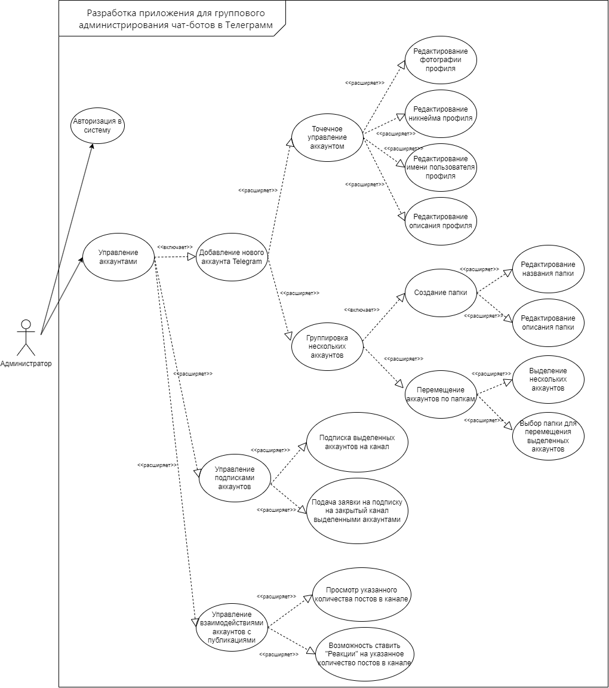

# Лабораторная работа 1 

## 1. Перечень заинтересованных лиц
* Администраторы - основные пользователи системы, будут осуществлять массовое управление несколькими личными аккаунтами в телеграме

## 2. Функциональные требования
1. **Доступ к системе:**
    * Аутентификация и авторизация пользователей в системе
2. **Управление аккаунтами:**
    * Добавление новых аккаунтов Telegram в систему в количестве от 1 до 10 000 штук.
    * Возможность точечного управления каждым аккаунтом, включая редактирование личной информации (фотография, никнейм, описание профиля).
    * Возможность создания и управления папок для группировки аккаунтов на основе различных критериев, определяемых самолично пользователем (например, по подписке на определенные каналы).
3. **Управление подписками**
    * Подписка на каналы Telegram с функцией плавности, позволяющей настраивать время для равномерного подписывания на каналы.
    * Подача заявок в закрытые каналы Telegram с функцией плавности.
4. **Управление взаимодействиями с публикациями (постами):**
    * Просмотр последних 1-100 постов в каналах Telegram с возможностью настройки плавности.
    * Возможность ставить "реакции" на посты с функцией плавности.

## 3. Диаграмма вариантов использования для функциональных требований

## 4. Перечень сделанных предположений

* Предполагается, что аккаунты для администрирования будет добавлять в сервис сам пользователь, система не предлагает возможность покупки аккаунтов.
* Функция плавности доступна для всего функционала действий с аккаунтами. Время и количество выполняемых действий.
* Использование открытого Telegram API для интеграции с функционалом мессенджера.
* Выбор канала для реализации основного функционала взаимодействия аккаунтов с месседжером происходит посредством введения ID(никнейма) опредленного канала
* Различный функционал конктрено по дминистрированию каналов в веб-сервисе не происходит, система назначена для управления только личными профилями.

## 5. Нефункциональные требования

* Безопасность - надежная защита данных как пользовательских аккаунтов внутри системы, так и данных для входа в Telegram, предоставляемых пользователями.
* Интерфейс точечного управления аккаунтами (смена никнейма, фотографии аккаунта и т.п.) должен быть максимально приближен к Telegram Dekstop.
* Веб-сервис адаптирован только для пользователей ПК и не предполагается к использованию на мобильных устройствах вследствие своей структуры.