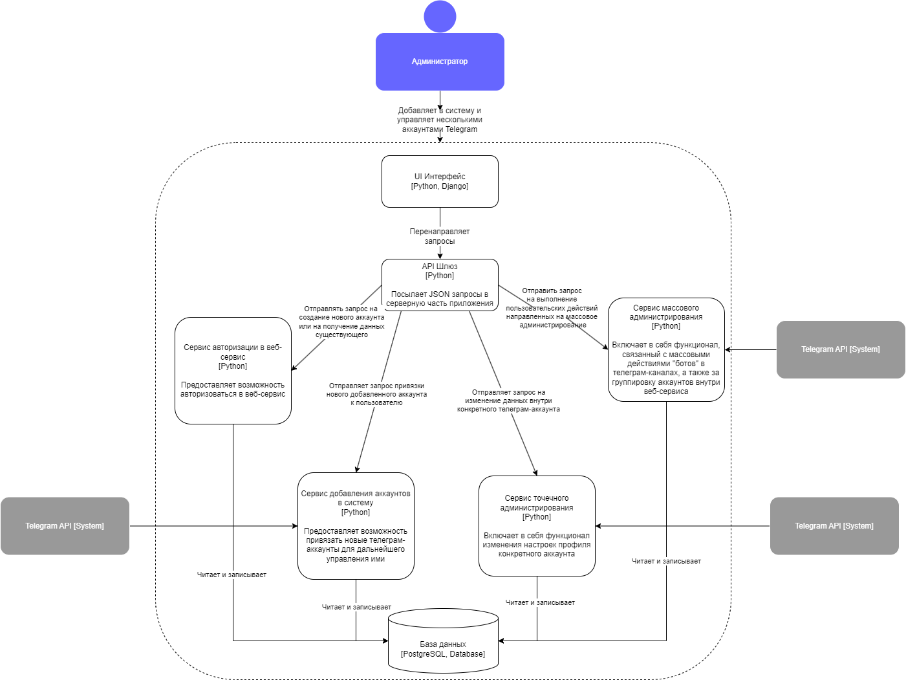

# Лабораторная работа 2 

## 1. Диаграмма системного контекста

## 2. Диаграмма контейнеров
Архитектурный стиль - микросервисная архитектура. Она лучше всего подходит для веб-сервиса, так как это беспечивает возможность паралельной разработки каждого этапа реализации, развертки и поддержки функционала сервиса, а также ускоряет работу системы в целом за счет оптимизации производительности компонентов. 

